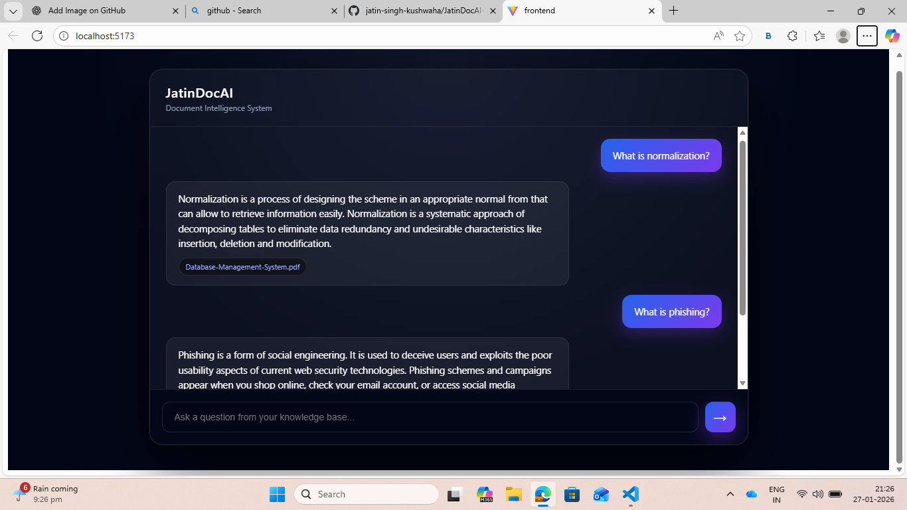
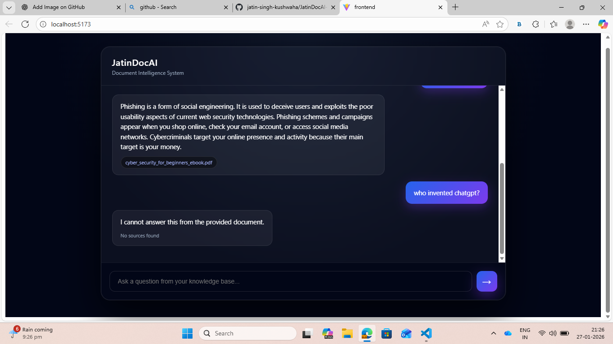

# 🤖 JatinDocAI — Document-Based AI Chatbot

JatinDocAI is a full-stack **Retrieval-Augmented Generation (RAG)** system that answers questions **strictly from your own documents** (PDF / DOCX / TXT) with **zero hallucination**.

---
## Demo Images


---

## 🧠 Tech Stack

- **FastAPI** (backend)
- **ChromaDB** (vector database)
- **Sentence Transformers** (embeddings)
- **Google Gemini** (LLM)
- **React** (chat-style frontend)

---

## ✨ Features

- **Ask questions from your documents**
- **Answers only from document context**
- **No hallucinations (no guessing)**
- **Persistent vector database**
- **Chat UI with history**
- **Source citations for every answer**
- **Folder-based document ingestion**

---

## 🗂 Project Structure

```text
JatinDocAI/
├── backend/
│   ├── main.py
│   ├── rag_utils.py
│   ├── requirements.txt
│   ├── uploads/          # Knowledge base PDFs
│   ├── chroma_db/        # Vector DB (ignored in git)
│   └── .env              # API keys (ignored in git)
├── frontend/
│   ├── src/
│   └── package.json
├── .gitignore
└── README.md
```

---

## 🚀 Quick Start

### Prerequisites

- **Python** 3.9+
- **Node.js** 18+
- **Git**

---

## 1) Clone

```bash
git clone https://github.com/jatin-singh-kushwaha/JatinDocAI-Document-Based-AI-Chatbot.git
cd JatinDocAI
```

---

## 2) Backend Setup

```bash
cd backend
pip install -r requirements.txt
```

Create `backend/.env` and add:

```env
GOOGLE_API_KEY=your_api_key_here
```

---

## 3) Documents

This project already includes sample documents in:

- `backend/uploads/`

Including:

- Cyber Security
- Database Management System
- History of India
- Machine Learning

---

## 4) Run Backend

```bash
cd backend
uvicorn main:app --reload
```

Backend runs at `http://127.0.0.1:8000`.

### 🔥 Automatic Document Ingestion (Proof)

On startup, the system automatically indexes all documents, e.g.:

- Ingested: `cyber_security_for_beginners_ebook.pdf`
- Ingested: `Database-Management-System.pdf`
- Ingested: `History of India.pdf`
- Ingested: `MLBOOK.pdf`

This confirms:

- PDFs are **read**
- Text is **chunked**
- Chunks are **embedded**
- Stored in **ChromaDB**
- No manual upload required

---

## 5) Run Frontend

```bash
cd frontend
npm install
npm run dev
```

Frontend runs at `http://localhost:5173`.

---

## 🧠 How It Works

- Documents are read from `backend/uploads/`
- Text is chunked
- Chunks are embedded
- Stored in ChromaDB
- A question triggers semantic search
- Gemini generates an answer **only** from retrieved context (with citations)

---

## 🧪 Real Questions You Can Ask

| Document | Example Question |
|---|---|
| Database Management System | What is normalization? |
| Cyber Security | What is phishing? |
| Machine Learning | What is supervised learning? |
| History of India | Who was Rani Lakshmi Bai? |

---

## ❌ Out-of-Scope Questions

These will correctly return:

> I cannot answer this from the provided document.

Examples:

- Who invented ChatGPT?
- What is Bitcoin?
- Who will win elections?

---

## 🔁 Adding New Documents

1. Put PDFs in `backend/uploads/`
2. Restart the backend:

```bash
uvicorn main:app --reload
```

They will be indexed automatically.

---

## 🔐 Git & Security

Ignored:

- `.env`
- `backend/chroma_db`
- `node_modules`

Your PDFs are included for demo purposes.

---

## 🏆 Why This Project Matters

JatinDocAI demonstrates real AI engineering:

- Vector search
- RAG architecture
- Gemini grounding
- Hallucination prevention
- Full-stack integration

---

## 👤 Author

**Jatin Singh Kushwaha**  

